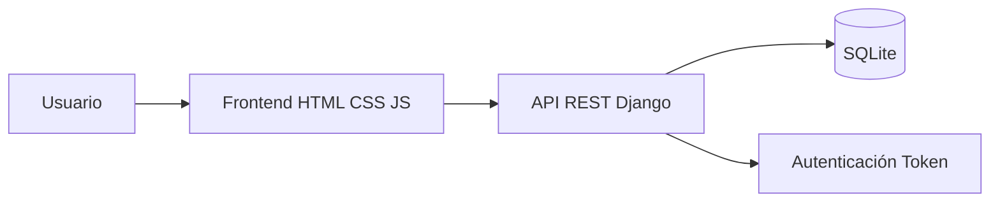

# Club de Billar Ordes - Proyecto Web


Aplicación web para el Club de Billar Ordes desarrollada con Django y Django REST Framework en el backend, y HTML5, CSS3 y JavaScript (ES6) en el frontend.

---

# Índice

* [Características](#características)
* [Tecnologías utilizadas](#tecnologías-utilizadas)
* [Requisitos previos](#requisitos-previos)
* [Instalación y ejecución](#instalación-y-ejecución)
* [API Endpoints](#api-endpoints)
* [Flujo general de la aplicación](#flujo-general-de-la-aplicación)
* [Notas adicionales](#notas-adicionales)

---

# Características

* Página principal informativa del club
* Tienda online
* Carrito de compras
* Simulación de pedidos
* Sistema de socios VIP
* Registro e inicio de sesión
* Cambio de contraseña
* Formulario de contacto
* API REST con Django REST Framework

---

# Tecnologías utilizadas

## Backend

* Python 3.10+
* Django 5+
* Django REST Framework 3.15+
* SQLite3

## Frontend

* HTML5
* CSS3
* JavaScript ES6

## Librerías adicionales

* `django-cors-headers`
* `Pillow`

## Autenticación

* Token Authentication (DRF)

---

# Requisitos previos

Antes de comenzar, asegúrate de tener instalado:

* Python 3.10 o superior
* Git
* Navegador moderno
* Visual Studio Code y PyCharm

> [!NOTE]
> Se recomienda utilizar un entorno virtual (`venv`) para evitar conflictos de dependencias.

---

# Instalación y ejecución

## 1. Clonar el repositorio o descargar el .zip

```bash
git clone https://github.com/tu-usuario/tu-repo.git
cd tu-repo
```

---

## 2. Crear y activar el entorno virtual

### PyCharm

```bash
Descarga la aplicación PyCharm, abre donde quieres alojar el proyecto y sigue estos pasos para crear el entorno virtual 
Link: https://imgur.com/a/ODQBTgD
```
### Abre la terminal desde Pycharm
> [!WARNING]
> Asegúrate de que el terminal muestre `(venv)` antes de continuar.

---

## 3. Instalar dependencias

```bash
pip install django djangorestframework django-cors-headers pillow
```

---

## 4. Ejecutar migraciones

Desde la raíz del proyecto:

```bash
python manage.py makemigrations api
python manage.py migrate
```

La base de datos SQLite (`db.sqlite3`) se generará automáticamente.

---

## 5. Crear superusuario

```bash
python manage.py createsuperuser
```

Introduce:

* Nombre de usuario
* Email (opcional)
* Contraseña

---

## 6. Iniciar el backend

```bash
python manage.py runserver
```

Backend disponible en:

```text
http://127.0.0.1:8000/
```

API REST:

```text
http://127.0.0.1:8000/api/
```

Panel de administración:

```text
http://127.0.0.1:8000/admin/
```

---

## 7. Crear productos desde el panel admin

Accede al panel de administración y añade productos desde la sección `Products`.

Cada producto debe incluir:

* Nombre
* Precio
* Stock
* Categoría

Ejemplos de categorías:

* tacos
* bolas
* mesas
* accesorios
* ropa

---

## 8. Iniciar el frontend

Abre otra terminal y sitúate en la carpeta `web/`.

### Visual Studio Code

1. Instalar extensión `Live Server`
2. Abrir:

```text
web/index.html
```

3. Seleccionar:

```text
Open with Live Server
```
Frontend disponible normalmente en:

```text
http://127.0.0.1:5500
```

---

# Rutas principales

| Página             | URL                                |
| ------------------ | ---------------------------------- |
| Landing Page       | `/web/landingPage/index.html`      |
| Tienda             | `/web/shop/index.html`             |
| Socios             | `/web/socios/index.html`           |
| Contacto           | `/web/contact/index.html`          |
| Login              | `/web/login/index.html`            |
| Registro           | `/web/register/index.html`         |
| Cambiar contraseña | `/web/cambiar-password/index.html` |
| Carrito            | `/web/shop/carrito/carrito.html`   |

---

# API Endpoints

| Método | Endpoint                  | Descripción                 |
| ------ | ------------------------- | --------------------------- |
| GET    | `/api/productos/`         | Obtener productos           |
| GET    | `/api/productos/<id>/`    | Obtener detalle de producto |
| POST   | `/api/register/`          | Registro de usuario         |
| POST   | `/api/login/`             | Inicio de sesión            |
| POST   | `/api/carrito/agregar/`   | Añadir producto al carrito  |
| GET    | `/api/carrito/`           | Obtener carrito             |
| PATCH  | `/api/carrito/item/<id>/` | Modificar cantidad          |
| DELETE | `/api/carrito/item/<id>/` | Eliminar producto           |
| POST   | `/api/pedidos/crear/`     | Finalizar compra            |
| PUT    | `/api/cambiar-password/`  | Cambiar contraseña          |

---

# Flujo general de la aplicación



---

# Notas adicionales

> [!NOTE]
> El proyecto utiliza SQLite para simplificar el desarrollo local.

> [!NOTE]
> El carrito y los pedidos funcionan de manera simulada.

> [!WARNING]
> No se recomienda subir la carpeta venv/ al repositorio.
---

# Autor

Proyecto desarrollado para el Club de Billar Ordes.
